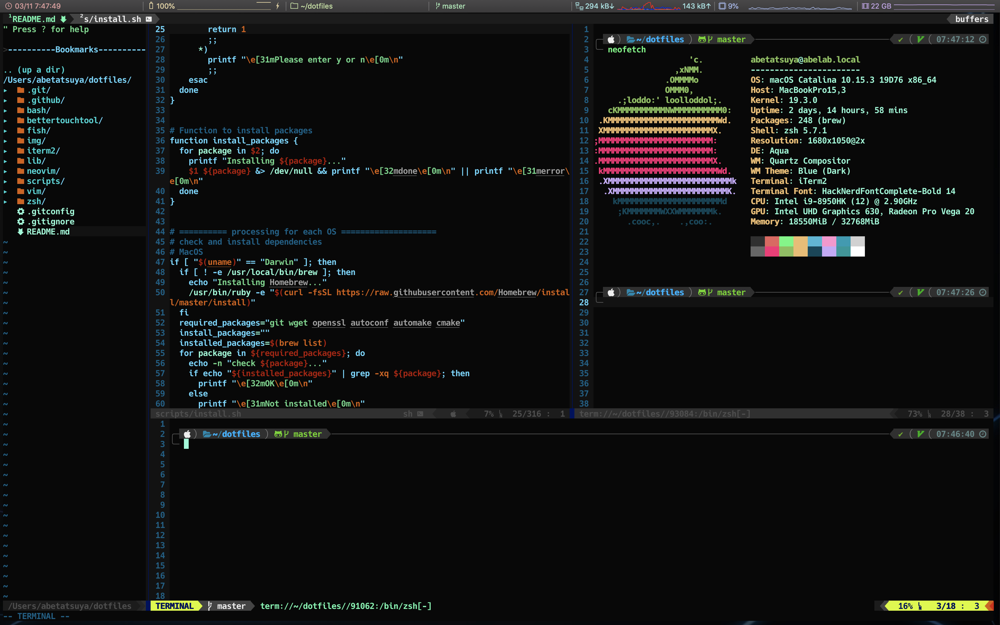

Dotfiles
========

[](https://travis-ci.org/AjxLab/dotfiles)




## Environments
- MacOS
- CentOS 7
- Ubuntu 16.04 and 18.04


## Setup
1. Setup dotfiles and install software as follow
```sh
# clone this repository
$ git clone https://github.com/AjxLab/dotfiles
$ cd dotfiles
```
2. Install Nerd Fonts
```sh
$ ./scripts/fonts-install.sh
```
3. Change Default Shell
```sh
# add zsh to the list of available shells (required sudo)
$ echo $(which zsh) >> /etc/shells
$ chsh -s $(which zsh)
```
### Install
```sh
# install essential tools (required sudo)
$ ./scripts/install.sh
```
### Build Latest Vim/Neovim
```sh
$ ./scripts/vim-build.sh
```
